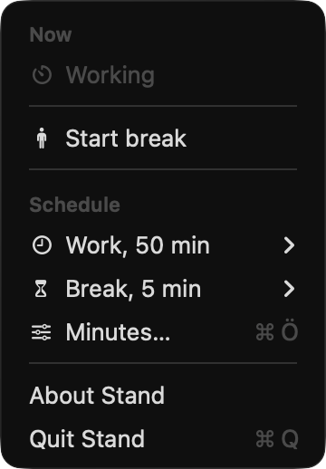
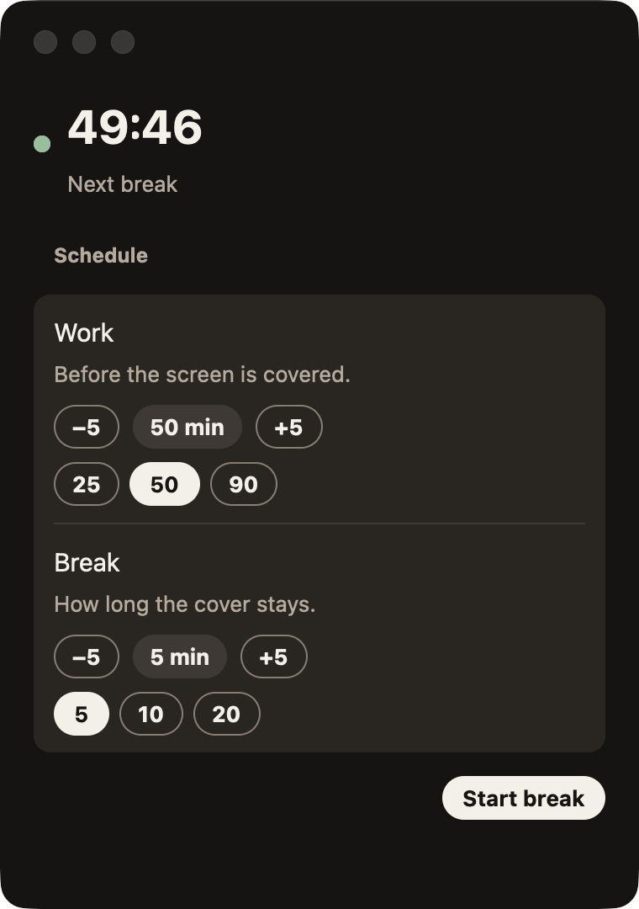
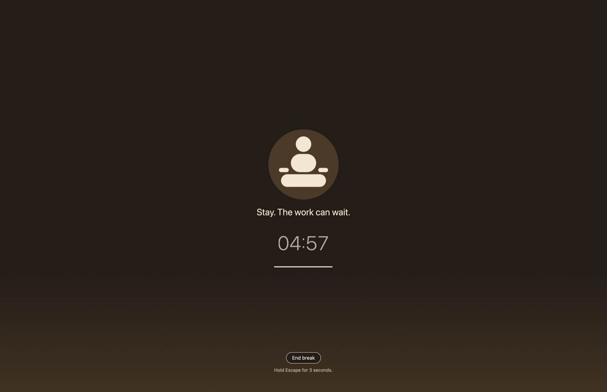

<p align="center">
  
</p>

<h1 align="center">Stand</h1>

<p align="center">
  A break timer for long sessions at the Mac.<br>
  It lives in the menu bar. When the time is up, the screen becomes a quiet room until you have rested.
</p>

<p align="center">
  <a href="https://github.com/halilatilla/stand/releases/latest"><strong>Download for Mac</strong></a>
</p>

The menu is how you run it. The window is where you set the minutes. The break covers the desktop, so nothing on it can pull you back.

<p align="center">
  
  &nbsp;&nbsp;&nbsp;
  
</p>

<p align="center">
  
</p>

<p align="center">
  <em>The menu. The window. A break.</em>
</p>

## A normal session

You work. Stand counts in the background. The menu bar shows only the icon.

Thirty seconds before a break, a small warning appears. Then the screen is covered. You see a seated figure, one quiet line, and a small clock. That line stays for the whole break.

**End break** stops it. Holding Escape for 3 seconds does the same. There is no snooze.

A call, or a fullscreen window, pauses the work clock. If you were already away for at least as long as the break, that time counts as the break.

Stand covers the screen with its own window. The Mac login lock stays with macOS, and an app cannot unlock it on a timer.

## The menu

Click the icon.

- **Now** says what is happening: Working, Paused, Away, Break soon, or On a break.
- **Start break** starts one immediately.
- **Work** and **Break** each open a short list. Work is 25, 50, or 90 minutes. Break is 5, 10, or 20.
- **Minutes…** opens the window when you want a different number. Command-comma does the same.
- **About Stand** and **Quit Stand** are at the bottom.

## The window

It follows light and dark.

The countdown is at the top. Under **Schedule**, click the minutes to type them, or use **−5** and **+5**. **Start break** is the filled button.

Work can be from 1 to 180 minutes. A break can be from 1 to 30. The defaults are 50 and 5.

Closing the window leaves Stand running in the menu bar.

## Install

This build is for Apple silicon (M1 or later) on macOS 11 or later.

1. Download the zip from the [latest release](https://github.com/halilatilla/stand/releases/latest).
2. Unzip it and move **Stand** to Applications. Replace the copy that is already there.
3. Open it. macOS will say it could not verify the app. Click **Done**.
4. Open **System Settings → Privacy & Security**, scroll to Security, and click **Open Anyway**.
5. Open Stand again. It appears in the menu bar.

Quit the old Stand from its menu before opening the new one.

If **Open Anyway** is not there:

```sh
xattr -dr com.apple.quarantine /Applications/Stand.app
```

## Build it yourself

You need [Xcode](https://developer.apple.com/xcode/) and Rust 1.98.1 (see `rust-toolchain.toml`).

```sh
xcode-select --install
cargo run --release
```

Stand is drawn with GPUI, the UI crate from [Zed](https://github.com/zed-industries/zed). That crate is not on crates.io, so `Cargo.toml` points at one Zed revision. This repo does not fork Zed.

## Linux

The window and the break can run on Linux. On Wayland, a compositor with layer shell covers the screen and takes the keyboard. Without that, Stand uses a normal fullscreen window, and a panel can stay visible.

```sh
sudo apt install pkg-config libwayland-dev libxkbcommon-dev libxkbcommon-x11-dev \
  libvulkan-dev libxcb1-dev libx11-dev libfontconfig1-dev cmake clang
cargo run --release
```

Closing the window on Linux quits the app.

## Where the minutes are saved

Stand writes them when you change them.

- Mac: `~/Library/Application Support/Stand/settings.json`
- Linux: `$XDG_CONFIG_HOME/stand/settings.json`, or `~/.config/stand/settings.json`

`STAND_CONFIG_DIR` overrides that folder.
